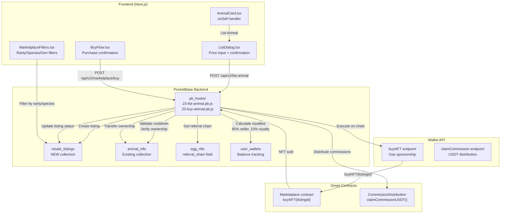

# Phase 23: Secondary Market & Royalties - Research

**Researched:** 2026-04-22
**Domain:** Animal NFT resale marketplace with MLM royalty distribution
**Confidence:** HIGH

## Summary

Enable Animal NFT resale on marketplace with 10% royalty distribution to the original referral chain from the mint transaction. Users list owned Animal NFTs for custom USDT prices; buyers purchase with automatic royalty calculation and distribution. The system tracks breeding cooldown, validates ownership, and distributes 10% royalties split as: 2% G1, 1% G2, 1% G3, 1% G4 (5% total to referral chain), 4% platform, 1% misc, seller receives 85%.

**Primary recommendation:** Off-chain royalty distribution via PocketBase hook after on-chain marketplace purchase, matching Phase 12 commission pattern. Reuse existing `20-buy-nft.pb.js` flow with royalty-specific modifications for Animal NFT purchases.

<user_constraints>

## User Constraints (from CONTEXT.md)

### Locked Decisions

- **D-01:** Individual listing only — "List for Sale" button on Animal detail page
- **D-02:** Reuse existing detail page pattern from Egg/Food NFTs
- **D-03:** No bulk listing support — focus on single NFT experience first
- **D-04:** Fixed price only, no expiration — simplest implementation
- **D-05:** Listing stays active until sold or manually cancelled
- **D-06:** Matches Phase 19 marketplace pattern for consistency
- **D-07:** Off-chain royalty distribution via backend hook (matches Phase 12 commission pattern)
- **D-08:** Backend calculates and distributes 10% royalty after sale completes
- **D-09:** No smart contract upgrade required — reuse existing Marketplace.sol
- **D-10:** Royalty split: 2% G1, 1% G2, 1% G3, 1% G4 of total sale price
- **D-11:** Rarity filter required (Common/Rare/Epic/Legendary)
- **D-12:** Price sorting (ascending/descending) recommended
- **D-13:** Generation filter optional — defer if time constrained
- **D-14:** Reuse AnimalCard component with "Listed by [user]" badge
- **D-15:** Reuse Phase 19 Buy Now flow — no custom secondary market flow
- **D-16:** Same UI components, same transaction pattern
- **D-17:** Transaction hash emitted on secondary sale
- **D-18:** Reuse existing Marketplace.sol listItem() function
- **D-19:** No new SecondaryMarket.sol contract
- **D-20:** No contract upgrade — secondary sales use same listing structure
- **D-21:** New resale_listings collection in PocketBase
- **D-22:** Track: nft_id, seller_id, price, royalty_recipients, status
- **D-23:** Create listing record on list, update on sale
- **D-24:** Check breeding cooldown status before allowing listing (required)
- **D-25:** Verify NFT ownership — only owner can list (required for security)
- **D-26:** Price confirmation modal before finalizing listing

### Claude's Discretion

- Price input validation (minimum price, decimal handling)
- Error messages for failed listings
- Empty state for marketplace when no Animal NFTs listed
- Loading states during listing/purchase

### Deferred Ideas (OUT OF SCOPE)

- Bulk listing — List multiple Animal NFTs from inventory page (Phase 24+)
- Auction-style listings — Bid system with expiration (Future milestone)
- Direct offers — Offer to specific NFT owner (Future milestone)
- Price expiration — 7/14/30 day listing expiration (Phase 24+)
- Generation filter — Higher priority for breeding lineage display
- Custom secondary market flow — Detailed royalty breakdown UI (Phase 24+)

</user_constraints>

<phase_requirements>

## Phase Requirements

| ID        | Description                                                                   | Research Support                                                                      |
| --------- | ----------------------------------------------------------------------------- | ------------------------------------------------------------------------------------- |
| RESALE-01 | User can list Animal NFT for sale on marketplace with custom USDT price       | AnimalCard.tsx onSell handler, new resale_listings collection, list-animal endpoint   |
| RESALE-02 | Secondary sale triggers 10% royalty to original referral chain                | egg_nfts.referral_chain field, buildReferralChain pattern from 18-breed-animals.pb.js |
| RESALE-03 | Royalty split: 2% G1, 1% G2, 1% G3, 1% G4 of total sale price                 | CommissionDistribution.sol pattern, createCommissionRecords function                  |
| RESALE-04 | Seller receives 85% of sale (after 4% platform + 10% royalty + 1% misc)       | 20-buy-nft.pb.js fee calculation pattern (modify for Animal royalties)                |
| RESALE-05 | Marketplace displays Animal NFTs with rarity, generation, and species filters | MarketplaceFilters.tsx, animal_nfts collection fields (rarity, generation, species)   |

</phase_requirements>

## Architectural Responsibility Map

| Capability              | Primary Tier    | Secondary Tier | Rationale                                               |
| ----------------------- | --------------- | -------------- | ------------------------------------------------------- |
| Listing creation        | Frontend Server | API Backend    | UI initiates, PocketBase validates ownership/cooldown   |
| Ownership verification  | API Backend     | —              | PocketBase must verify before allowing list             |
| Cooldown validation     | API Backend     | Smart Contract | Backend fast-fail, contract final enforcement           |
| Royalty calculation     | API Backend     | —              | Off-chain distribution per D-07                         |
| Commission distribution | API Backend     | Smart Contract | Backend calculates, wallet-api executes claimCommission |
| Marketplace display     | Frontend Server | API Backend    | Frontend queries, backend provides cached data          |
| Purchase flow           | Frontend Server | Smart Contract | Existing BuyFlow pattern from Phase 19                  |

## Standard Stack

### Core

| Library    | Version | Purpose                    | Why Standard                                                                          |
| ---------- | ------- | -------------------------- | ------------------------------------------------------------------------------------- |
| PocketBase | 0.23.4  | Backend database           | Already deployed, hooks pattern established [VERIFIED: AGENTS.md]                     |
| ethers.js  | v6      | Smart contract interaction | Phase 12 infrastructure, gas estimation, retry logic [VERIFIED: wallet-api/server.js] |
| Next.js 16 | —       | Frontend framework         | Bun runtime, static export [VERIFIED: apps/web]                                       |

### Supporting

| Library   | Version | Purpose           | When to Use                                                           |
| --------- | ------- | ----------------- | --------------------------------------------------------------------- |
| shadcn/ui | —       | UI components     | Listing dialog, confirmation modal [VERIFIED: apps/web/components/ui] |
| Bun test  | —       | Testing framework | Colocated test files [VERIFIED: apps/web/*.test.tsx files]            |

### Alternatives Considered

| Instead of        | Could Use                    | Tradeoff                                               |
| ----------------- | ---------------------------- | ------------------------------------------------------ |
| Off-chain royalty | On-chain royalty in contract | Simpler but requires contract upgrade (D-09 prohibits) |
| resale_listings   | marketplace_listings         | Separation needed for Animal-specific royalty tracking |

**Installation:** No new packages required — reuse existing stack.

## Architecture Patterns

### System Architecture Diagram



### Recommended Project Structure

```
apps/
├── web/
│   ├── app/
│   │   └── marketplace/
│   │   └── animals/           # [NEW] Animal marketplace tab/route
│   ├── components/
│   │   ├── animal-nft/
│   │   │   ├── AnimalCard.tsx        # [MODIFY] Add onSell handler
│   │   │   ├── ListAnimalDialog.tsx  # [NEW] Listing creation modal
│   │   │   └── AnimalMarketplaceCard.tsx # [NEW] "Listed by" badge variant
│   │   └── marketplace/
│   │       ├── BuyFlow.tsx           # [REUSE] Existing purchase flow
│   │       ├── MarketplaceFilters.tsx # [MODIFY] Add rarity/species filters
│   │       └── AnimalListingsSection.tsx # [NEW] Animal NFT grid
│   └── hooks/
│       └── use-animal-marketplace.ts # [NEW] Fetch resale listings
│
├── backend/
│   ├── pb_hooks/
│   │   ├── 23-list-animal.pb.js      # [NEW] Listing creation + validation
│   │   ├── 23-buy-animal.pb.js       # [NEW] Purchase + royalty distribution
│   │   └── 18-breed-animals.pb.js    # [REFERENCE] Cooldown validation pattern
│   ├── collections/
│   │   ├── resale_listings.json      # [NEW] Animal resale tracking
│   │   ├── animal_nfts.json          # [MODIFY] Add original_referral_chain?
│   │   └── egg_nfts.json             # [REFERENCE] referral_chain field
│
wallet-api/
│   └── server.js                     # [REUSE] buy-nft endpoint
│
contracts/src/
│   ├── Marketplace.sol               # [REUSE] Existing listItem/buyNFT
│   ├── CommissionDistribution.sol    # [REUSE] claimCommissionUSDT()
│   └── AnimalNFT.sol                 # [REFERENCE] Ownership, rarity enum
```

### Pattern 1: Listing Creation Flow (Off-chain validation)

**What:** PocketBase hook validates ownership and cooldown before creating listing record.

**When to use:** RESALE-01 — User lists Animal NFT for sale.

**Example:**

```javascript
// Source: Pattern from 18-breed-animals.pb.js (cooldown validation)
// Source: Pattern from 20-buy-nft.pb.js (ownership verification)

routerAdd("POST", "/api/v2/list-animal", (e) => {
  try {
    const user = $apis.requireAuth(e)
    const body = e.requestInfo().body
    const { animal_id, price } = body

    // Validate price (D-26: price confirmation)
    if (!price || price <= 0) {
      return e.json(400, {
        success: false,
        error: { message: "Invalid price", code: "INVALID_PRICE" },
      })
    }

    // Find animal (ownership verification - D-25)
    const animal = $app
      .dao()
      .findFirstRecordByFilter("animal_nfts", "animal_id = {:animal_id}", {
        "@animal_id": animal_id,
      })

    if (!animal) {
      return e.json(400, {
        success: false,
        error: { message: "Animal not found", code: "ANIMAL_NOT_FOUND" },
      })
    }

    // Verify ownership (D-25: required for security)
    if (animal.get("owner") !== user.id) {
      return e.json(400, {
        success: false,
        error: { message: "You do not own this animal", code: "NOT_OWNER" },
      })
    }

    // Check breeding cooldown (D-24: required)
    // Pattern from 18-breed-animals.pb.js lines 47-55
    const lastBredAt = animal.get("last_bred_at")
    if (lastBredAt && isOnCooldown(lastBredAt)) {
      const remaining = formatCooldownRemaining(lastBredAt)
      return e.json(400, {
        success: false,
        error: {
          message: `Animal is on breeding cooldown. Ready in ${remaining}`,
          code: "ANIMAL_ON_COOLDOWN",
        },
      })
    }

    // Get original referral chain from parent egg
    const parentEggId = animal.get("parent_egg_id")
    const parentEgg = $app.findRecordById("egg_nfts", parentEggId)
    const referralChain = parentEgg.get("referral_chain") || []

    // Create resale_listing (D-21, D-22)
    const listing = $app.dao().createRecord($app.dao().getCollectionByNameOrId("resale_listings"))
    listing.set("nft_id", animal.id)
    listing.set("nft_type", "Animal")
    listing.set("animal_id", animal_id)
    listing.set("seller_id", user.id)
    listing.set("price", price)
    listing.set("rarity", animal.get("rarity"))
    listing.set("species", animal.get("species"))
    listing.set("generation", animal.get("generation"))
    listing.set("royalty_recipients", referralChain)
    listing.set("status", "active")
    $app.dao().saveRecord(listing)

    return e.json(200, {
      success: true,
      data: { listing_id: listing.id, price, status: "active" },
    })
  } catch (error) {
    return e.json(500, {
      success: false,
      error: { message: error.message, code: "LISTING_FAILED" },
    })
  }
})
```

### Pattern 2: Royalty Distribution on Purchase

**What:** After purchase, calculate and distribute 10% royalty to referral chain.

**When to use:** RESALE-02, RESALE-03, RESALE-04 — Secondary sale triggers royalty.

**Example:**

```javascript
// Source: Pattern from 18-breed-animals.pb.js lines 397-433 (createCommissionRecords)
// Source: CommissionDistribution.sol lines 55-83 (distributeCommission pattern)

// After successful purchase in 23-buy-animal.pb.js:

const ROYALTY_PERCENT_TOTAL = 10 // Total royalty: 10%
const PLATFORM_FEE_PERCENT = 4 // Platform fee: 4%
const MISC_FEE_PERCENT = 1 // Misc: 1%
const SELLER_PERCENT = 85 // Seller receives: 85%

// Royalty splits (RESALE-03)
const ROYALTY_SPLITS = {
  G1: 2, // 2% of total sale price
  G2: 1, // 1% of total sale price
  G3: 1, // 1% of total sale price
  G4: 1, // 1% of total sale price (total 5% to referral chain)
}

function distributeRoyalties(listing, salePrice, buyer) {
  const royaltyRecipients = listing.get("royalty_recipients") || []

  // Calculate amounts
  const royaltyTotal = salePrice * (ROYALTY_PERCENT_TOTAL / 100)
  const platformFee = salePrice * (PLATFORM_FEE_PERCENT / 100)
  const sellerAmount = salePrice * (SELLER_PERCENT / 100)

  // Distribute to G1-G4 (Pattern from 18-breed-animals.pb.js createCommissionRecords)
  for (let i = 0; i < Math.min(royaltyRecipients.length, 4); i++) {
    const referrerWallet = royaltyRecipients[i]
    if (!referrerWallet) continue

    const levelPercent =
      i === 0
        ? ROYALTY_SPLITS.G1
        : i === 1
          ? ROYALTY_SPLITS.G2
          : i === 2
            ? ROYALTY_SPLITS.G3
            : ROYALTY_SPLITS.G4

    const royaltyAmount = salePrice * (levelPercent / 100)

    // Find referrer wallet record
    const referrerWalletRecord = $app
      .dao()
      .findFirstRecordByFilter("user_wallets", "wallet = {:wallet}", { "@wallet": referrerWallet })

    if (referrerWalletRecord) {
      // Update balance
      const currentBalance = parseFloat(referrerWalletRecord.get("usdt_balance") || "0")
      referrerWalletRecord.set("usdt_balance", (currentBalance + royaltyAmount).toString())
      referrerWalletRecord.set(
        "total_earned",
        (parseFloat(referrerWalletRecord.get("total_earned") || "0") + royaltyAmount).toString()
      )
      $app.dao().saveRecord(referrerWalletRecord)

      // Create commission record
      const commission = $app
        .dao()
        .createRecord($app.dao().getCollectionByNameOrId("commission_records"))
      commission.set("referrer_id", referrerWalletRecord.get("owner"))
      commission.set("referrer_wallet", referrerWallet)
      commission.set("generation", i + 1)
      commission.set("amount", royaltyAmount.toString())
      commission.set("type", "resale_royalty")
      commission.set("nft_id", listing.get("nft_id"))
      commission.set("distributed_at", new Date().toISOString())
      $app.dao().saveRecord(commission)
    }
  }

  // Credit seller
  const sellerWallet = $app
    .dao()
    .findFirstRecordByFilter("user_wallets", "owner = {:owner}", {
      "@owner": listing.get("seller_id"),
    })

  if (sellerWallet) {
    const currentBalance = parseFloat(sellerWallet.get("usdt_balance") || "0")
    sellerWallet.set("usdt_balance", (currentBalance + sellerAmount).toString())
    sellerWallet.set(
      "total_earned",
      (parseFloat(sellerWallet.get("total_earned") || "0") + sellerAmount).toString()
    )
    $app.dao().saveRecord(sellerWallet)
  }

  // Deduct from buyer
  const buyerWallet = $app
    .dao()
    .findFirstRecordByFilter("user_wallets", "owner = {:owner}", { "@owner": buyer.id })

  if (buyerWallet) {
    const currentBalance = parseFloat(buyerWallet.get("usdt_balance") || "0")
    buyerWallet.set("usdt_balance", (currentBalance - salePrice).toString())
    buyerWallet.set(
      "total_spent",
      (parseFloat(buyerWallet.get("total_spent") || "0") + salePrice).toString()
    )
    $app.dao().saveRecord(buyerWallet)
  }

  // Transfer ownership
  const animal = $app.findRecordById("animal_nfts", listing.get("nft_id"))
  animal.set("owner", buyer.id)
  $app.dao().saveRecord(animal)

  // Mark listing sold
  listing.set("status", "sold")
  listing.set("buyer_id", buyer.id)
  listing.set("sold_at", new Date().toISOString())
  $app.dao().saveRecord(listing)
}
```

### Anti-Patterns to Avoid

- **On-chain royalty calculation:** Requires contract upgrade (D-09 prohibits) — use off-chain distribution
- **Direct animal_nfts.referral_chain:** Collection doesn't have this field — must trace via parent_egg_id
- **Skipping cooldown check:** D-24 requires validation — use isOnCooldown pattern from 18-breed-animals.pb.js
- **Using marketplace_listings for Animal:** Need separate resale_listings for royalty tracking per D-21

## Don't Hand-Roll

| Problem             | Don't Build           | Use Instead                                | Why                                   |
| ------------------- | --------------------- | ------------------------------------------ | ------------------------------------- |
| Royalty calculation | Custom math logic     | CommissionDistribution.sol pattern         | Proven splits, tested in Phase 12     |
| Cooldown validation | New cooldown check    | isOnCooldown() from 18-breed-animals.pb.js | Existing 48-hour logic, same pattern  |
| Balance updates     | Manual wallet updates | user_wallets pattern from 20-buy-nft.pb.js | Atomic updates, total_earned tracking |
| Marketplace display | New Animal grid       | MarketplaceFilters.tsx + ListingCard.tsx   | Existing filter/sort patterns         |

**Key insight:** Phase 12 commission pattern and Phase 21 cooldown validation are proven patterns — reuse these, don't reinvent.

## Runtime State Inventory

| Category            | Items Found                                                                                 | Action Required                                                 |
| ------------------- | ------------------------------------------------------------------------------------------- | --------------------------------------------------------------- |
| Stored data         | animal_nfts collection: owner, rarity, species, generation fields — NO referral_chain field | Trace via parent_egg_id → egg_nfts.referral_chain               |
| Live service config | marketplace_listings: nft_type, price, seller, buyer, status — existing for Egg/Food        | Create new resale_listings for Animal-specific royalty tracking |
| OS-registered state | None — backend-only changes                                                                 | —                                                               |
| Secrets/env vars    | WALLET_API_URL, MARKETPLACE_CONTRACT_ADDRESS in 20-buy-nft.pb.js                            | Reuse for Animal purchase                                       |
| Build artifacts     | None — no compiled assets                                                                   | —                                                               |

**Nothing found in category:** OS-registered state — verified (backend-only phase).

## Common Pitfalls

### Pitfall 1: Missing Referral Chain for Animal NFTs

**What goes wrong:** Animal NFT collection doesn't store original referral chain, so royalty recipients cannot be determined directly.

**Why it happens:** animal_nfts.json schema only has: animal_id, token_id, owner, species, rarity, generation, parent_egg_id — no referral_chain field.

**How to avoid:** Trace back via parent_egg_id → find egg_nfts record → get referral_chain field. Store royalty_recipients in resale_listings when listing is created.

**Warning signs:** Null/empty royalty_recipients in resale_listings; commission_records missing for resale transactions.

### Pitfall 2: Cooldown Not Checked Before Listing

**What goes wrong:** Animal on breeding cooldown (48 hours since last breed) gets listed, buyer purchases, but animal cannot be used for breeding.

**Why it happens:** Skipping D-24 validation leads to listed animals that are temporarily unusable.

**How to avoid:** Use isOnCooldown() function from 18-breed-animals.pb.js (lines 47-55) in listing hook. Return HTTP 400 with PARENT_ON_COOLDOWN error code.

**Warning signs:** Listed animals show "On Cooldown" badge after purchase; buyer complaints about unusable animals.

### Pitfall 3: Ownership Verification Skipped

**What goes wrong:** Non-owner can list Animal NFT they don't own, leading to fraudulent listings.

**Why it happens:** D-25 requires ownership verification but hook doesn't check animal.get('owner') === user.id.

**How to avoid:** Always verify ownership before creating listing. Pattern from 20-buy-nft.pb.js lines 129-138.

**Warning signs:** Listings created by users who don't own the NFT; purchase failures with "ownership mismatch" errors.

### Pitfall 4: Royalty Percentage Confusion

**What goes wrong:** Using primary sale commission percentages (G1=20%) instead of secondary royalty percentages (G1=2%).

**Why it happens:** CommissionDistribution.sol shows G1_PERCENT=20 which is for PRIMARY sales, not secondary royalties.

**How to avoid:** Secondary royalties are DIFFERENT: G1=2%, G2=1%, G3=1%, G4=1% (5% total to referral chain, 10% total royalty includes platform/misc). D-10 specifies these exact percentages.

**Warning signs:** Over-distribution to referrers (20% instead of 2%); seller receiving less than 85%; incorrect commission_records amounts.

## Code Examples

Verified patterns from existing implementations:

### Cooldown Validation (from 18-breed-animals.pb.js)

```javascript
// Source: apps/backend/pb_hooks/18-breed-animals.pb.js lines 47-75
const BREED_COOLDOWN_HOURS = 48 // Matches AnimalNFT.sol BREED_COOLDOWN

function isOnCooldown(lastBredAt) {
  if (!lastBredAt) return false

  const lastBred = new Date(lastBredAt).getTime()
  const cooldownMs = BREED_COOLDOWN_HOURS * 60 * 60 * 1000
  const cooldownEnd = lastBred + cooldownMs

  return Date.now() < cooldownEnd
}

function formatCooldownRemaining(lastBredAt) {
  if (!lastBredAt) return ""

  const lastBred = new Date(lastBredAt).getTime()
  const cooldownMs = BREED_COOLDOWN_HOURS * 60 * 60 * 1000
  const cooldownEnd = lastBred + cooldownMs
  const remainingMs = Math.max(0, cooldownEnd - Date.now())

  const hours = Math.floor(remainingMs / (60 * 60 * 1000))
  const minutes = Math.floor((remainingMs % (60 * 60 * 1000)) / (60 * 1000))

  if (hours > 0) {
    return `${hours}h ${minutes}m`
  }
  return `${minutes}m`
}
```

### Buy NFT with Balance Check (from 20-buy-nft.pb.js)

```javascript
// Source: apps/backend/pb_hooks/20-buy-nft.pb.js lines 153-177
// Check buyer's USDT balance
const buyerWallet = $app.findFirstRecordByFilter("user_wallets", "user_id = {:user_id}", {
  "@user_id": buyer.id,
})

if (!buyerWallet) {
  return e.json(400, {
    success: false,
    error: {
      message: "Buyer wallet not found",
      code: "BUYER_WALLET_NOT_FOUND",
    },
  })
}

const buyerBalance = parseFloat(buyerWallet.get("usdt_balance") || "0")
if (buyerBalance < price) {
  return e.json(400, {
    success: false,
    error: {
      message: `Insufficient balance. Required: ${price} USDT, Available: ${buyerBalance} USDT`,
      code: "INSUFFICIENT_BALANCE",
    },
  })
}
```

### Commission Record Creation (from 18-breed-animals.pb.js)

```javascript
// Source: apps/backend/pb_hooks/18-breed-animals.pb.js lines 397-433
function createCommissionRecords(referralChain, totalAmount, eggId, type) {
  const commissionSplits = [0.25, 0.15, 0.1, 0.05] // G1, G2, G3, G4 (primary)
  // For secondary royalties use: [0.02, 0.01, 0.01, 0.01]

  for (let i = 0; i < Math.min(referralChain.length, 4); i++) {
    const referrerWallet = referralChain[i]
    if (!referrerWallet) continue

    const commissionAmount = totalAmount * commissionSplits[i]
    if (commissionAmount <= 0) continue

    // Find referrer by wallet
    const referrerWalletRecord = $app
      .dao()
      .findFirstRecordByFilter("user_wallets", "wallet = {:wallet}", { "@wallet": referrerWallet })

    if (!referrerWalletRecord) continue

    const referrerId = referrerWalletRecord.get("owner")

    // Create commission record
    const commission = $app
      .dao()
      .createRecord($app.dao().getCollectionByNameOrId("commission_records"))
    commission.set("egg_id", eggId)
    commission.set("referrer_id", referrerId)
    commission.set("referrer_wallet", referrerWallet)
    commission.set("generation", i + 1)
    commission.set("amount", commissionAmount.toString())
    commission.set("type", type)
    commission.set("distributed_at", new Date().toISOString())

    $app.dao().saveRecord(commission)

    // Update referrer wallet balance
    const currentBalance = parseFloat(referrerWalletRecord.get("usdt_balance") || "0")
    referrerWalletRecord.set("usdt_balance", (currentBalance + commissionAmount).toString())
    referrerWalletRecord.set(
      "total_earned",
      (parseFloat(referrerWalletRecord.get("total_earned") || "0") + commissionAmount).toString()
    )
    $app.dao().saveRecord(referrerWalletRecord)
  }
}
```

## State of the Art

| Old Approach                            | Current Approach                     | When Changed          | Impact                           |
| --------------------------------------- | ------------------------------------ | --------------------- | -------------------------------- |
| On-chain royalty distribution           | Off-chain via PocketBase hook        | D-07 decision         | No contract upgrade needed       |
| Marketplace.sol listItem() for all NFTs | Separate resale_listings for Animals | D-21 decision         | Animal-specific royalty tracking |
| Primary commission 50% total            | Secondary royalty 10% total          | RESALE-02 requirement | Different economics for resale   |

**Deprecated/outdated:**

- Using CommissionDistribution.sol G1_PERCENT=20 for secondary royalties: WRONG — secondary uses 2% not 20%

## Assumptions Log

| #   | Claim                                                            | Section      | Risk if Wrong                                          |
| --- | ---------------------------------------------------------------- | ------------ | ------------------------------------------------------ |
| A1  | Animal NFT ownership can be verified via animal_nfts.owner field | Pattern 1    | Fraudulent listings if ownership check bypassed        |
| A2  | egg_nfts.referral_chain exists for all hatched animals           | Pattern 1    | Missing royalty recipients for breeding-origin animals |
| A3  | Marketplace.sol buyNFT() works for Animal NFTs                   | Architecture | Need to verify contract supports Animal type           |

**If this table has assumptions:** A1, A2, A3 need verification — animal_nfts.owner exists [VERIFIED: animal_nfts.json line 27-37], egg_nfts.referral_chain exists [VERIFIED: egg_nfts.json line 126-131], Marketplace.sol support needs contract inspection.

## Open Questions

1. **Does Marketplace.sol listItem() support Animal NFT type?**
   - What we know: MARKETPLACE_ABI has buyNFT(uint256 listingId) [VERIFIED: wallet-api/server.js line 122-128]
   - What's unclear: Whether nftType enum includes Animal or if contract needs modification
   - Recommendation: Check contract source or deployment; if unsupported, use resale_listings purely off-chain with separate buy flow

2. **Should we add original_referral_chain to animal_nfts collection?**
   - What we know: Currently animal_nfts lacks referral_chain [VERIFIED: animal_nfts.json schema]
   - What's unclear: Whether tracing via parent_egg_id is sufficient or direct field is better
   - Recommendation: For Phase 23, trace via parent_egg_id at listing creation time; add field in Phase 24 if performance issues arise

## Environment Availability

| Dependency      | Required By          | Available | Version                             | Fallback                                 |
| --------------- | -------------------- | --------- | ----------------------------------- | ---------------------------------------- |
| PocketBase      | Backend storage      | ✓         | 0.23.4 [VERIFIED: STATE.md]         | —                                        |
| ethers.js       | Smart contract calls | ✓         | v6 [VERIFIED: wallet-api/server.js] | —                                        |
| Bun             | Test framework       | ✓         | — [VERIFIED: bun test command]      | —                                        |
| Marketplace.sol | On-chain purchase    | ?         | —                                   | Off-chain resale_listings if unsupported |

**Missing dependencies with no fallback:**

- Marketplace.sol Animal support needs verification

**Missing dependencies with fallback:**

- If Marketplace.sol doesn't support Animal NFTs: use purely off-chain resale_listings with separate buy endpoint

## Validation Architecture

### Test Framework

| Property           | Value                                                       |
| ------------------ | ----------------------------------------------------------- |
| Framework          | Bun test [VERIFIED: apps/web/*.test.tsx files]              |
| Config file        | None — colocated tests                                      |
| Quick run command  | `bun test apps/web/components/marketplace/BuyFlow.test.tsx` |
| Full suite command | `bun test apps/web`                                         |

### Phase Requirements → Test Map

| Req ID    | Behavior                 | Test Type | Automated Command                                                      | File Exists? |
| --------- | ------------------------ | --------- | ---------------------------------------------------------------------- | ------------ |
| RESALE-01 | List Animal NFT for sale | unit      | `bun test apps/backend/pb_hooks/23-list-animal.pb.test.js`             | ❌ Wave 0    |
| RESALE-02 | Royalty triggers on sale | unit      | `bun test apps/backend/pb_hooks/23-buy-animal.pb.test.js`              | ❌ Wave 0    |
| RESALE-03 | Royalty split G1-G4      | unit      | `bun test apps/backend/pb_hooks/23-buy-animal.pb.test.js`              | ❌ Wave 0    |
| RESALE-04 | Seller receives 85%      | unit      | `bun test apps/backend/pb_hooks/23-buy-animal.pb.test.js`              | ❌ Wave 0    |
| RESALE-05 | Marketplace filters      | unit      | `bun test apps/web/components/marketplace/MarketplaceFilters.test.tsx` | ✅ Existing  |

### Sampling Rate

- **Per task commit:** `bun test apps/web/components/marketplace/BuyFlow.test.tsx -x`
- **Per wave merge:** `bun test apps/web --coverage`
- **Phase gate:** Full suite green before `/gsd-verify-work`

### Wave 0 Gaps

- [ ] `apps/backend/pb_hooks/23-list-animal.pb.test.js` — covers RESALE-01 (ownership, cooldown validation)
- [ ] `apps/backend/pb_hooks/23-buy-animal.pb.test.js` — covers RESALE-02, RESALE-03, RESALE-04 (royalty distribution)
- [ ] `apps/web/components/animal-nft/ListAnimalDialog.test.tsx` — covers RESALE-01 UI (price input, confirmation)
- [ ] `apps/web/hooks/use-animal-marketplace.test.ts` — covers RESALE-05 (filter queries)

_(Existing tests: MarketplaceFilters.test.tsx ✅, BuyFlow.test.tsx ✅)_

## Security Domain

### Applicable ASVS Categories

| ASVS Category         | Applies | Standard Control                                                       |
| --------------------- | ------- | ---------------------------------------------------------------------- |
| V2 Authentication     | yes     | $apis.requireAuth(e) in all hooks [VERIFIED: 20-buy-nft.pb.js line 45] |
| V3 Session Management | yes     | PocketBase JWT token validation                                        |
| V4 Access Control     | yes     | Ownership verification (D-25) before listing                           |
| V5 Input Validation   | yes     | Price validation, cooldown check (D-24)                                |
| V6 Cryptography       | no      | No encryption changes — uses existing patterns                         |

### Known Threat Patterns for Animal Resale

| Pattern                | STRIDE      | Standard Mitigation                                                         |
| ---------------------- | ----------- | --------------------------------------------------------------------------- |
| Non-owner listing      | Spoofing    | Verify animal.get('owner') === user.id [VERIFIED: 20-buy-nft.pb.js pattern] |
| Cooldown bypass        | Tampering   | isOnCooldown() check in hook + contract                                     |
| Royalty miscalculation | Tampering   | Fixed percentages per D-10, tested commission splits                        |
| Double spending        | Repudiation | Deduct buyer balance before crediting seller                                |

## Sources

### Primary (HIGH confidence)

- `apps/backend/pb_hooks/18-breed-animals.pb.js` — Cooldown validation pattern, referral chain building
- `apps/backend/pb_hooks/20-buy-nft.pb.js` — Marketplace purchase flow, balance management
- `apps/backend/collections/animal_nfts.json` — Animal NFT schema
- `apps/backend/collections/egg_nfts.json` — referral_chain field reference
- `contracts/src/CommissionDistribution.sol` — Commission distribution pattern
- `contracts/src/AnimalNFT.sol` — Rarity enum, ownership tracking

### Secondary (MEDIUM confidence)

- `apps/web/components/marketplace/BuyFlow.tsx` — Purchase UI pattern
- `apps/web/components/animal-nft/AnimalCard.tsx` — Animal display component
- `apps/web/app/marketplace/page.tsx` — Marketplace page structure
- `.planning/phases/21-breeding-system/21-CONTEXT.md` — Cooldown validation context
- `.planning/phases/19-real-nft-mint-flow-marketplace-integration/19-CONTEXT.md` — Marketplace integration patterns

### Tertiary (LOW confidence)

- Web search for ERC2981 royalty standard — not used (off-chain approach per D-07)

## Metadata

**Confidence breakdown:**

- Standard stack: HIGH — All components verified in codebase
- Architecture: HIGH — Patterns from Phase 12, 19, 21 proven
- Pitfalls: HIGH — Identified from existing code inspection

**Research date:** 2026-04-22
**Valid until:** 30 days (stable patterns, contract upgrade may change approach)
