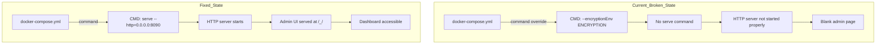

# PocketBase Docker Compose Fix Plan

## Problem Statement

The PocketBase admin dashboard shows a blank white page with no errors when accessed via `http://localhost:8090/_/`.

## Root Cause Analysis

### Issue 1: Incorrect Docker Compose Command

**File:** [`eggo-pb/docker-compose.yml`](../eggo-pb/docker-compose.yml:6)

**Current Configuration:**
```yaml
command: ["--encryptionEnv", "ENCRYPTION"]
```

**Problem:** This command only specifies the encryption environment flag but does NOT include the `serve` command that PocketBase requires to start the HTTP server with the admin UI.

**Expected Behavior:** PocketBase needs the `serve` subcommand to:
1. Start the HTTP server
2. Serve the admin dashboard static files
3. Handle API requests

### Issue 2: Command Override

**File:** [`eggo-pb/Dockerfile`](../eggo-pb/Dockerfile:40-41)

The Dockerfile has the correct default command:
```dockerfile
ENTRYPOINT ["./pocketbase"]
CMD ["serve", "--http=0.0.0.0:8090"]
```

However, `docker-compose.yml` **overrides** the `CMD` with its own `command`, which breaks the server startup.

### Issue 3: Empty pb_public Directory

**Directory:** [`eggo-pb/pb_public/`](../eggo-pb/pb_public/)

The `pb_public` folder is empty. While PocketBase has a built-in admin UI, custom static files in `pb_public` would be served at the root. This is not the cause of the blank admin dashboard but should be noted.

---

## Solution

### Fix 1: Update docker-compose.yml Command

**Change:**
```yaml
# FROM:
command: ["--encryptionEnv", "ENCRYPTION"]

# TO:
command: ["serve", "--http=0.0.0.0:8090", "--encryptionEnv=ENCRYPTION"]
```

**Explanation:**
- `serve` - Required subcommand to start the HTTP server
- `--http=0.0.0.0:8090` - Binds to all interfaces on port 8090 (required for Docker)
- `--encryptionEnv=ENCRYPTION` - Uses the ENCRYPTION environment variable for data encryption

### Fix 2: Optional - Use Environment File

Add `env_file` support for better security practices:

```yaml
services:
  pocketbase:
    # ... other config
    env_file:
      - .env
    environment:
      - ENCRYPTION=${ENCRYPTION:-4nWpfKByg2u3tkbbHAZ34div}
```

---

## Files to Modify

| File | Change | Priority |
|------|--------|----------|
| `eggo-pb/docker-compose.yml` | Fix command to include `serve` | Critical |
| `eggo-pb/.env` | Add ENCRYPTION variable (optional) | Low |

---

## Testing Steps

1. **Stop current container:**
   ```bash
   cd eggo-pb
   docker compose down
   ```

2. **Apply the fix** (update docker-compose.yml)

3. **Rebuild and start:**
   ```bash
   docker compose up -d --build
   ```

4. **Check container logs:**
   ```bash
   docker compose logs -f pocketbase
   ```
   
   Expected output should show:
   - `Server started at http://0.0.0.0:8090`
   - No errors about missing commands

5. **Access admin dashboard:**
   - Open browser to `http://localhost:8090/_/`
   - Should see the PocketBase admin login page

6. **Verify API health:**
   ```bash
   curl http://localhost:8090/api/health
   ```
   
   Expected response:
   ```json
   {"status": "ok"}
   ```

---

## Alternative Solutions

### Option A: Remove command from docker-compose.yml

If you want to use the Dockerfile's default command:

```yaml
services:
  pocketbase:
    # Remove the command line entirely
    # The Dockerfile CMD will be used
    environment:
      - ENCRYPTION=4nWpfKByg2u3tkbbHAZ34div
```

### Option B: Use official PocketBase image

Consider using the official PocketBase Docker image:

```yaml
services:
  pocketbase:
    image: ghcr.io/pocketbase/pocketbase:latest
    command: ["serve", "--http=0.0.0.0:8090"]
    volumes:
      - ./pb_data:/pb_data
      - ./pb_hooks:/pb_hooks
      - ./pb_migrations:/pb_migrations
```

---

## Architecture Diagram



---

## Risk Assessment

| Risk | Impact | Mitigation |
|------|--------|------------|
| Data loss | Low | pb_data is mounted as volume, data persists |
| Downtime | Low | Container restarts quickly |
| Configuration drift | Low | Changes are in version control |

---

## Rollback Plan

If the fix doesn't work:

1. Revert docker-compose.yml to original
2. Try running PocketBase locally without Docker:
   ```bash
   cd eggo-pb
   ./pocketbase serve --http=0.0.0.0:8090
   ```
3. Check if the issue is Docker-specific or PocketBase configuration

---

## Additional Recommendations

1. **Add health check endpoint monitoring** - The current healthcheck is good but consider adding alerting

2. **Document the ENCRYPTION key** - Ensure the encryption key is backed up securely

3. **Consider using secrets** - For production, use Docker secrets instead of environment variables for sensitive data

4. **Add logging** - Consider adding a log volume for persistent logs
